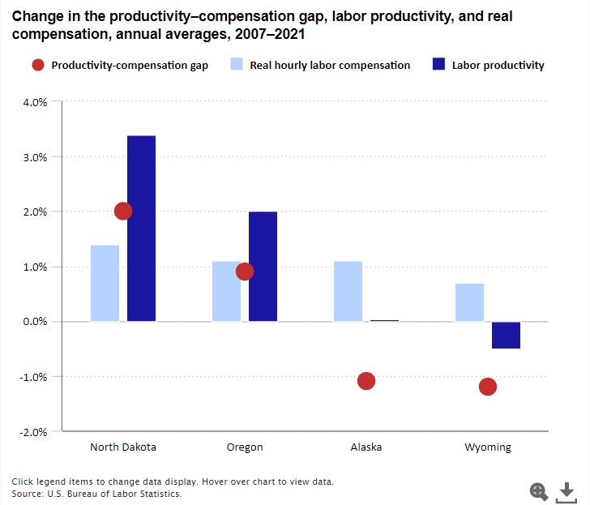
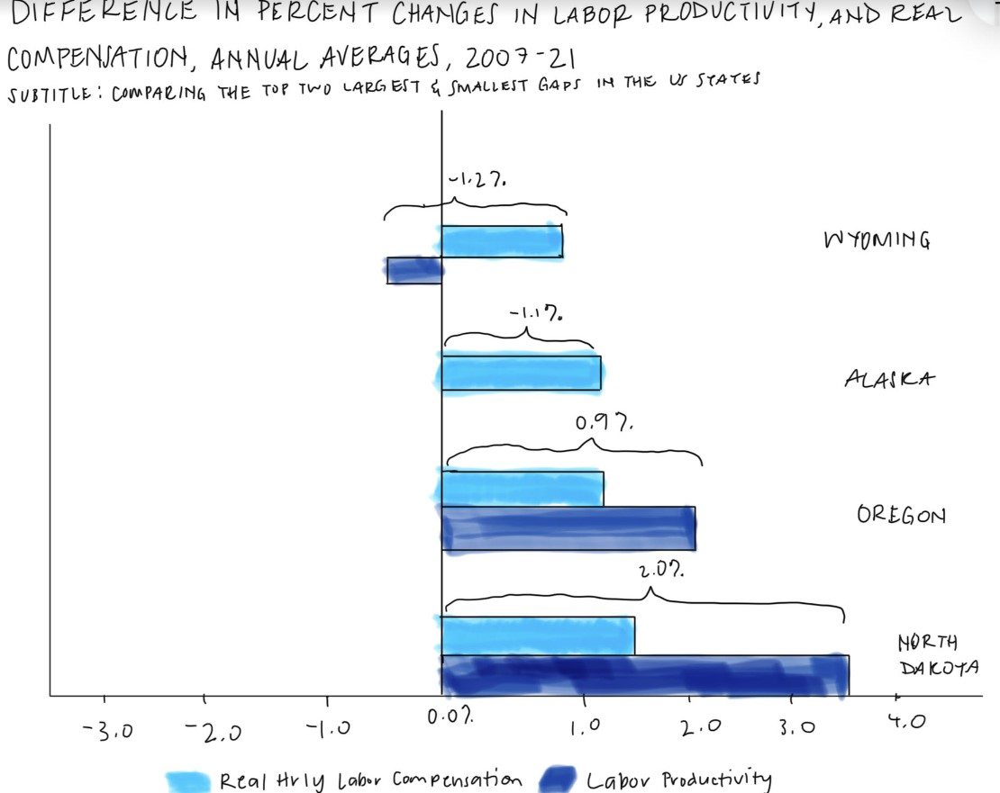

# Critique by Design

### [Source data from Bureau of Labor Statistics]((https://www.bls.gov/news.release/pdf/prin4.pdf) 
I chose to use this data visualization in particular versus other data visualizations in this story about productivity statistics mainly because I found it to be surprising. Many studies show that higher compensation levels lead to higher levels of output or productivity. This story checks out with North Dakota and Oregon, two states with the largest difference between labor productivity and real hourly labor compensation. However, the opposite is true for Alaska and Wyoming—they show negative levels in the productivity-compensation gap. What further confused me was the red dot used to explain the difference. Initially, I thought the red dot was attempting to explain a certain trend due to their placements. However, after reading the text box that goes along with the visualization, I realized that they were simply meant to depict the differences in the heights of the gaps. 

This story is intended to be for the average American, at least as indicated by the story’s first slide, but doesn’t seem to be that comprehensible to get the snapshot. I wanted to make the visual easier to digest, and therefore, simpler to read for someone who isn’t necessarily a labor economic or policymaker. After reading through Stephen Few’s “Data Visualization Effectiveness Profile,” while I do think that the initial visualization is complete, engaging, relatively truthful, and not distracting visually, there are aspects that can be tweaked to increase its usefulness, perceptibility, and intuitiveness, further augmenting the graph’s overall effectiveness. 

## Wireframe

I wanted to organize and orient the graph in a way that I found to be easier to interpret, as well as address any gaps in the original visualization’s usefulness, perceptibility, and intuitiveness. For me, the first step was to change the title. Reading the original title threw me off, so I wanted to make it more direct and easier to understand to address the lack of intuitiveness. I also decided to change the orientation of the graph to horizontal rather than vertical, as I thought it would be easier to read the percentages, and make the difference between the two variables easier to distinguish, thus improving the perceptibility.

To be quite honest, the part that I was getting stuck with most was the usefulness. Why should the average person care about this visualization? How can it be a more compelling visualization to tell a story that people actually care about? With this in mind, I figured the main takeaway would be the gap to show the significant differences in labor productivity and compensation, which is why I wanted to highlight the difference in the averages more distinctly through the brackets.  

## Feedback
### Feedback from friends
#### Feedback 1: Student, late 20s, background in statistics and economics.
Question 1: Can you tell me what you think this is?
I think this is measuring the percent change in labor productivity, but I’m confused by the title, and the differences.

Question 2: Can you describe what it’s telling you? 
There’s a significant difference between what labor production is and what compensation actually is. They’re not on par; you would think they would be closer.

Question 3: Who do you think the intended audience is? 
Policymakers or government officials who want to see annual changes in productivity and compensation. Another audience could be unions that want to present the reality that real compensation is actually not high. 

Question 4: Is there anything you’d change or do differently? 
I’d prefer to see the actual percentages of each one or just the gap. The title is confusing, especially using both changes and differences. Maybe you can highlight North Dakota to show the biggest difference, with the other states as the comparisons. In terms of the visual changes, take out from -2.0% to decrease the space people have to wait to see the bars and put the labels on the left as people read from left to right.

#### Feedback 2: Working adult, mid-late 20s, background in non-profit mental health services.
Question 1: Can you tell me what you think this is?
I’m assuming that there’s a relationship between the two [variables], and whether there’s a message that’s being conveyed is an opinion or a statement. But off the bat, I’m confused by the brackets above the bars. 

Question 2: Can you describe what it’s telling you? 
This is telling us the relationship between labor productivity and compensation with the extremes of the range of the US states highlighted. 

Question 3: Who do you think the intended audience is? 
Labor economists and C-suite execs making decisions about compensation.

Question 4: Is there anything you’d change or do differently? 
I’d change the brackets to show the gap properly from the heights of the bars. The difference in percent change is difficult to understand to break down. Maybe you could just focus on the gap instead. I think that would be easier to interpret. I’m stuck seeing too many data points, and confused by what the actual takeaway is.

### Feedback from peers in class: 
Similar to the feedback I received from my friends, my peers were also puzzled by the overall takeaway from the graph. They thought there were too many variables to focus on. While they did understand the title more so than my friends, they also took a while to interpret the graph. Like all the other feedback, my peers suggested focusing solely on the gap to give the overall takeaway, and highlight the largest gap relative to the other states on the graph. 

### My takeaways from the feedback:
It was very eye-opening to get various feedback from friends and peers. I wanted to get feedback from a mixture of people from different areas of knowledge of this material. Since the source story was meant to be for the average person, it became quite clear that the visualizations, both the original and my wireframe, were not as comprehensible as I originally thought. Those who did have more background in this subject matter still found the overall story difficult to comprehend. As I was getting the feedback, I started realizing how integral context is, I wondered if I seemingly digested the material more simply because I had read more about the background and looked at the data, versus my reviewers who needed more context. In an effort to adapt the feedback, I decided to just show the productivity-compensation gap, and highlight North Dakota, which has the largest gap in comparison to the rest of the states, while making the title, hopefully, more comprehensible for any audience member, no matter what their familiarity with the subject matter is. 
 
## Sketching a Solution

