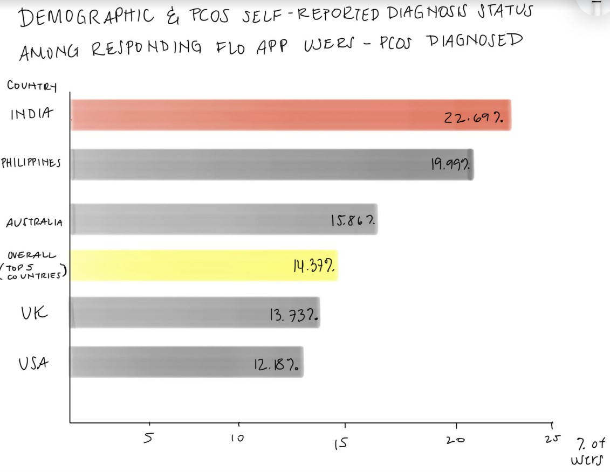

# Final Project: Part 1
## PCOS Awareness, Stigma, and Related Health Concerns in the South Asian Diaspora 
### SUMMARY:
Polycystic Ovary Syndrome (PCOS) is an illness where the ovaries in a female reproductive system produce an above-average amount of androgens, male sex hormones, in women and menstruating people. While androgens are usually present in menstruating people at low levels, high levels of androgens can cause difficulties with menstruation such as irregular periods, as well as fertility issues, associations with anxiety and depression, and insulin resistance. Though there are growing numbers of women and menstruating people who have been diagnosed with PCOS, the illness is still ill-defined within the medical field due to different sets of diagnostic criteria and little research until recently. According to the [Centers for Disease Control](https://www.cdc.gov/diabetes/basics/pcos.html), PCOS affects approximately 6-12% (5 million) of women and menstruating people in the US. Insulin resistance, where bodies can create insulin but not use it effectively, can increase the risk of diseases such as Type 2 Diabetes. 

In multiple studies, even young, healthy South Asian subjects are shown to have a higher propensity toward insulin resistance, and a higher risk for Type 2 Diabetes, [up to four times more than any other ethnic group](https://www.sutterhealth.org/health/south-asian/risks/type-2-diabetes). Worldwide, [65-70% of those diagnosed with PCOS are affected by insulin resistance](https://www.ncbi.nlm.nih.gov/pmc/articles/PMC3277302/), though it is one of the least discussed side effects of PCOS. It is unknown whether PCOS causes insulin resistance or vice versa. The intersection of PCOS and insulin resistance is being studied more than before, but proper messaging for insulin resistance testing has been lacking, especially for those diagnosed with PCOS. For this reason, it’s important to call for further research in this field, and impress upon South Asian women the need for a proper diagnosis to help prevent further associated illnesses.

### OUTLINE:
#### Set up:
While PCOS is slowly gaining more recognition, PCOS has had a history of being dismissed or mistreated in the medical community. Many of the physical attributes of PCOS, including acne, hair loss, hirsutism, bloating, and weight gain, are also misunderstood, and often misattributed as “laziness” and “poor hygiene,” especially in the South Asian community. In order to combat this stereotype, I want to convey through data, statistics, and recent literature the startling number of women and menstruating people who are silently suffering through an illness that may lead to further and more severe medical conditions, especially Type 2 Diabetes. The long-term hope is that the medical community also takes this illness and its side effects more seriously, in order to ensure a greater variety of prescriptions for PCOS that can address as many diagnosed people as possible. 

#### Conflict:
I want to highlight this data, in particular that of the South Asian community, as a way to draw the community’s attention to the next steps to either help diagnose PCOS or next steps to reduce further related illnesses, as well as the medical field’s attention to illnesses and diseases that need to be studied differently based on ethnicity and/or race. 

#### Resolution: 
While I have not collected all my possible data, I want to be able to relay the reported statistics and figures in a comprehensible manner to again highlight how more research needs to be conducted in this area. My overall goal is to provide as much data as possible in a clear, visualization that will motivate more South Asian women and menstruating people to check for a PCOS diagnosis. 

### SKETCHES:

I made a stacked column chart to depict the most reported symptoms of PCOS. Oftentimes in media, PCOS is only discussed through the lens of fertility, which is certainly an important factor for many, but not the only symptom. Other important symptoms include irregular cycles, hyperpigmentation, bloating, and hirsutism. 

I chose to make a bar graph to depict the number of diagnosed and reported cases of PCOS in various countries, including India, the UK, and the US. I believe that this graph depicts the proportional imbalance of South Asian women and menstruating people who are diagnosed with PCOS in comparison to those diagnosed in other countries. However, I recognize that there are limitations to this data, as is discussed below in the Data portion of this page. 

I chose to make a line graph using the data from the NIH to show an unbiased perspective of a cross-comparison of reported symptoms from South Asians compared to Caucasians. Here we can see that there are significant differences between South Asian and Caucasian women predominantly when it comes to weight and menstrual problems. 

### DATA: 
Most of my PCOS-related data will be from data reported by the Flo app, a health app that allows menstruating people to track their cycles as reported in the journal [Reproductive Biology and Endocrinology](https://rbej.biomedcentral.com/articles/10.1186/s12958-021-00719-y#Sec8) in its article “Characterization of polycystic ovary syndrome among Flo app users around the world.” The app took data from Flo users in 142 countries with at least 100 respondents in total. The majority of users were from the US, followed by the UK, India, the Philippines, and Australia. The limitation of this data is that some of the self-reported data have not been diagnosed by a physician. 

In an effort to report unbiased data, I also am using data reported in Table 3 of [Health Qual Life Outcomes’](https://www.ncbi.nlm.nih.gov/pmc/articles/PMC3024276/) article “Do South Asian women with PCOS have poorer health-related quality of life than Caucasian women with PCOS? A comparative cross-sectional study” published through the National Institutes of Health. The aim of this particular study was to compare health outcomes on the basis of diagnosed PCOS in South Asian and Caucasian women. The data actually doesn’t match with other reports I’ve found from news articles reporting the prevalence of PCOS in South Asian women compared to Caucasian women. 

### METHOD AND MEDIUM:
I will be using Flourish and Tableau mainly for my visualizations. I want to utilize their tools to make my story as visually appealing and clear as possible. I will be using Shorthand to present my overall findings. I want to be able to display my visualizations, and the associated data in as simple a way as possible, with smooth transitions. I believe Shorthand will help me achieve my narrative goals as seamlessly as possible. 
